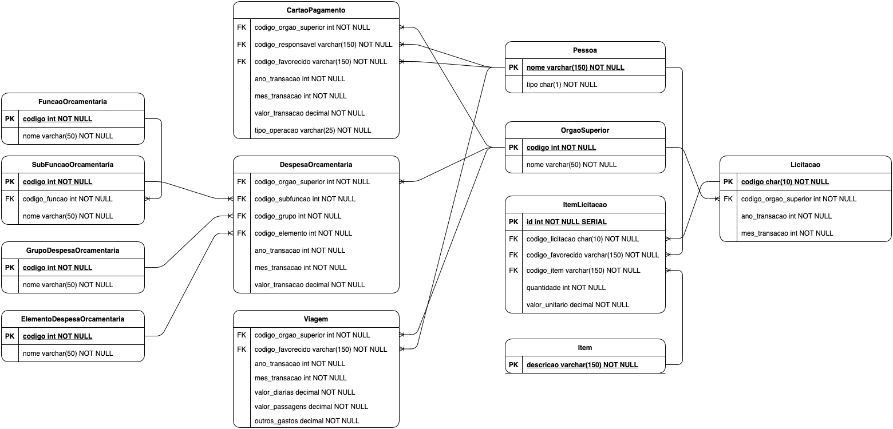

# transparência amada, Brasil
Projeto de Banco de Dados (UFRGS)

ETL e análise dos dados do [Portal da Transparência do Governo Federal](http://www.portaltransparencia.gov.br).

## Requisitos
Algumas bibliotecas em Python são utilizadas nesse projeto. 
Para poder executar os scripts, você também precisa instalá-las, como segue:
```{shell}
$ pip install -r requirements.txt
```

# Extract, Load e Transform (ETL)

## Extract
Primeiro passo é extrair os dados do portal da transparência. 
Esse método irá extrair todos os arquivos do portal, dada um fonte, entre os
anos de 2015 e 2020 e salvará em `data/raw/<fonte>/`. Nosso projeto irá processar as seguintes fontes:
- **cpgf**: cartões de pagamento do Governo Federal
- **cpcc**: cartões de pagamento do Governo Federal - Compras Centralizadas
- **despesas-execucao**: despesas públicas
- **licitacoes**: gastos com licitações
- **compras**: gastos com contratos
- **viagens**: viagens a serviço

Para extrair os arquivos, basta executar:
```{shell}
$ python -u main.py extract <source>
```
Por exemplo:
```{shell}
$ python -u main.py extract "despesas-execucao"
```
Ou não passar esse parâmetro para extrair os arquivos de todas as fontes.

## Transform
O processo de load descompacta os arquivos extraídos do portal, limpa o cabeçalho e une 
todos os registros em um único arquivo localizado em `data/processed/<fonte>/`. 
Esse processo irá criar ~23GB de dados. 

Para tanto, basta executar:
```{shell}
$ python -u main.py transform <source>
```
Por exemplo:
```{shell}
$ python -u main.py transform "despesas-execucao"
```
Ou não passar esse parâmetro para transformar os arquivos de todas as fontes.

## Load
Esse processo insere os dados dos arquivos criados na etapa *transform* no banco de dados.
Todos os campos são interpretados como texto para que possam ser processados futuramente.

### Dependências
O processo de *load* possui algumas dependências, são elas:
- Banco de dados PostgreSQL instalado ou acessível remotamente
- Base de dados já criada
- Um usuário com privilégio de criar/excluir tabelas e schemas e inserir dados nas tabelas

Para rodar o *load*, basta executar:
```{shell}
$ python -u main.py load <host> <database> <username> <password> <source>
```
Onde, `host` é o endereço do banco de dados. 
Se ele estiver localizado localmente, então `host = localhost`.
Os demais campos são autodescritivos.

Esse processo insere **~78 milhões** de linhas no banco de dados.

## Normalize
Adicionamos mais uma etapa ao ETL, a normalização dos dados. Isto é, nessa etapa reduzimos
a redundância dos dados ao criar relações entre as tabelas. Nós também filtramos alguns valores
desnecessário para a análise. A etapa de normalização executa os comandos SQL disponíveis no
diretório `sql`. Com o intuito de automatizar a criação e população das tabelas, criamos um 
comando no mesmo formato dos demais:
```{shell}
$ python -u main.py normalize <host> <database> <username> <password> <source>
```

### Modelo ER
Após executar a normalização, essa é a representação entidade-relacionamento da base:



# API
Depois de executar todas as etapas do ETL, os dados estão prontos para serem analisados.
Para tanto, iremos criar uma API com chamadas básicas que permita o usuário acessar os dados
sem conectar no banco de dados, mas sim, apenas na API permitindo também que várias outras 
aplicações sejam construídas a partir desta.

## Iniciar a API
Para iniciar aplicação da API, basta executar na linha de comando:
```{shell}
$ export FLASK_APP=api/api.py
$ flask run
```

## Chamada API
A API possui apenas duas chamadas:

- `http://127.0.0.1:5000` retorna `{"message": "API is working."}`
- `http://127.0.0.1:5000/query<n>` retorna um JSON com o resultado da consulta `n` como uma lista de registros. 
  Exemplo: `{"result": [{x: 2014, y: 2000000}, {x: 2015, y: 78033221}, {x: 2016, y: 34531210}, ...]}`.

# Frontend
Para rodar a interface de usuário é necessário primeiro acessar à pasta e instalar as dependências apenas na primeira vez:

```{shell}
$ cd frontend
$ npm install
```

Feito isso o servidor pode ser executado com:

```{shell}
$ npm start
```